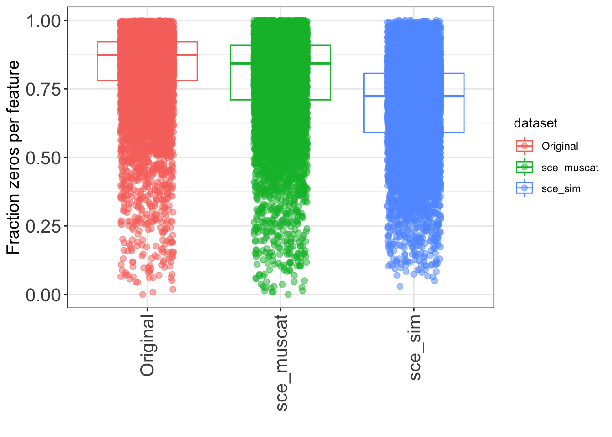
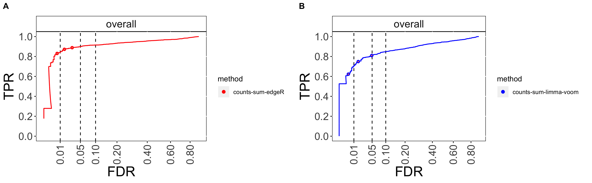
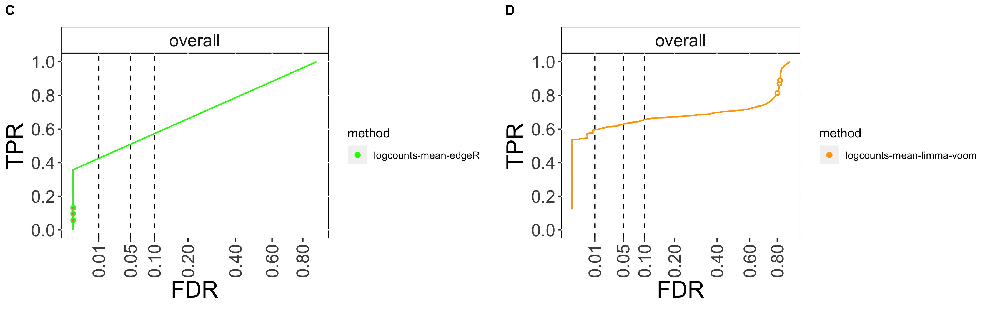
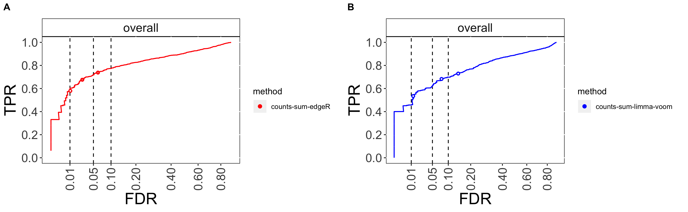
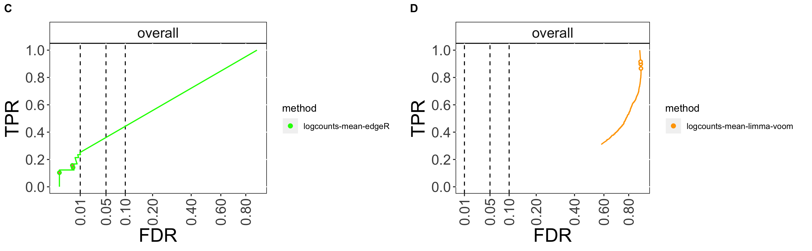

```{r, include=FALSE}
knitr::opts_chunk$set(echo = TRUE)
```

# Introduction
Single-cell RNA sequencing technologies allow the quantification of RNA molecules in biological samples in counts of reads mapped to the genes. Indeed, they are used to profile genome-wide high-resolution instances of gene expression activity and modifications in individual cells over time as well as monitor discrepancies in gene expression in different groups or treatments across conditions. However, the presence of multi-condition scRNA-seq datasets dictates the need to perform sample-level inferences.    

The aim of this project is to extend the simulation framework Muscat (Multi-sample multi-group scRNA-seq analysis tools) [1] established in the group of Prof. Mark Robinson in collaboration with Pierre Luc Germain. More precisely, the ``muscat`` simulation framework currently used in the group does not take the gene-gene correlation into account, sampling each gene in each cell independently. It is suspected that this may bias the evaluation of downstream analysis techniques. Since it is well known that gene-gene correlation is observed in real world data sets, the goal of our analysis is to explore the effect of gene-gene correlation on the differential expression (DE) analysis, while compairing it with the ``muscat`` simulation framework.

# Datasets

For performimg our simulations we utilized the single-cell RNA-seq of mouse cortex injected with Lipopolysaccharide (LPS) or with a vehicle treatment dataset (Crowell et al.)[1].

The class SingleCellExperiment keeps track of the counts and their associated metadata within a single object.


## Preprocessing 

Firstly, we filter the doublet cells, produced directly from counts using overclustering-based generation of artifical doublets, separately on each sample using the scDblFinder class [2]. After removing genes that are not detected across all cells, we implement Quality control and filtering, using the R scater package [3], to correct for technical effects that distort the downstream analysis. In the provided SingleCellExperiment object, we also integrate various per-cell quality control statistics from perCellQCMetrics function. The first plot demonstrates an expected increasing number of detected genes with an increasing total count. Each point represents a cell that is coloured according to its cluster id. We then remove cells that have very few or many detected genes. Therefore, we compute the distributions of QC metrics, the observation of which helps us to select the apprppriate thresholds for removing possible low-quality genes. 

A better way to choose these thresholds is implemented via the isOutlier function, where we exclude cells whose feature counts, number of detected features, and percentage of mitochondrial genes go beyond 2 Median Absolute Deviations (MADs) of the median and the percentage of mitochondrial genes overcomes 8\%. In addition, we plot the top 50  most-expressed features and subsequently remove the lowly expressed genes. Indeed, in the plot the rows correspond to genes and bars describe the expression of genes in single cells. Genes are sorted based on the median expression of each gene, which is indicated by circles.

We then calculate the distribution of percentages of the variance of the normalized log-expression values across cells that is explained by each variable/factor in the colData of our sce object, using the getVarianceExplained() function. [4]

```{r, warning=FALSE}

#Load data
suppressPackageStartupMessages({
library(SingleCellExperiment)
library(scater)
library(tidyverse)
library(ggplot2)
library(gridExtra)
library(grid)
library(edgeR)
library(irlba)
library(muscat)
library(countsimQC)
library(TMB)
library(cowplot)
library(scDblFinder)
library(dplyr)
library(UpSetR)
library(uwot)
library(Rtsne)  
library(countsimQC)
  })

source('./Preprocessing_fun.R', echo=FALSE)
set.seed(123)

#Load object
sce = readRDS("week13_SCE_clustered.rds")
```

```{r,echo=FALSE,include=FALSE}
sce = prep_steps(sce)
```


*Plot of the original data*


*Plot of Top 50 most-expressed features*

# Methods

## Simulation
We created a simulation framework that produces a correlation structure in the simulated counts to explore the effect of such correlation on analysis techniques. To make our results comprable to existing methods (muscat simulation framework) we tried to produce a simulation that allows us to generate data sets with similar characteristics as the muscat framework in terms of number of cells, number of samples, number of cluster and the distribution of those cells across samples and clusters. The typical input data set is a ``SingleCellExperiment`` file which consits of multiple wild types samples containing multiple cell types.

The pipeline of the simulation is:

* Generate correlation structure reflected in mean counts for each gene and cell
* Sample counts for each cell type from a negative binomial distribution based on mean counts, gene-wise dispersion and library size
* Concatenate simulated data into a ``SingleCellExperiment``

The relevant functions of the simulation were implemented in the R-package ``sta426`` that can be installed from the git repository (adrianom2017/sta426-project/sta426). The documentation of the package is very limited at the moment and solely focused on the simulation function ``create_dataset()``.

### Generation of correlation structure
In a first step the ``SingleCellExperiment`` is subsected into each sample. Each sample is further subsected into the single cell types. This is the original data for a single simulation round, i.e. we construct the correlation structure for each cell type of each sample seperately as follows:

* Perform PCA on the data with gene as features
* Compute _k_-nearest neighbours of a cell
* Randomly select _N_ cells from the nearest neighbours with replacement
* Average the top principal components to create an artificial cell
* Project artificial cell from PCA space back into logcounts space

By averaging different subsets we obtain a correlation structure among the artificial cells. Note that we have to repeate this procedure for each cell type of each sample.

### Construct simulated ``SingleCellExperiment``
To obtain a complete artificial dataset we need to generate multiple samples with different cell types. Therefore we repeat the above described procedure for each cell type in a sample and for each sample in the original data set. This gives us a matrix of mean logcounts of the artificial cells each associated with a given cell type and sample id. We convert this mean logcount matrix back to a count matrix and use this mean count matrix together with the gene-wise dispersion computed from the original data set as well as the library size of a given cell to generate artifical counts by sampling from a negative binomial distribution. This results in the final artifical count matrix.

### Simulation work-flow overview
We summarise this section by giving an overview of the whole procedure to generate the artificial counts:

* Prepare original data for simulation with ``prepSim()`` from ``muscat`` framework to filter the original data set
* For each sample and cell type generate the mean count based on PC averaging of a subset of _k_-nearest neigbours
* Based on mean count matrix, gene-wise dispersion and library size sample artificial counts from negative binomial

### Run simulation
In this section we follow the muscat workflow to set up the sce for the simulation with muscat (sce_prep). Based on the ``sce_prep`` object we run the muscat simulation (``sce_muscat``). From this object we extract the information needed to setup ``sce_prep2`` that is used by our simulation. We introduced this step to enable a simulation that is as close as possible to the muscat simulation such that a comparison of the two methods is as meaningful as possible. The preparation steps contain:

* Identify the (resampled) genes used in the musact simulation
* Extract the logFC of each genes from the metadata
* Extract the library sizes for each cell

Based on this information we construct ``sce_prep2`` sucht that our simulation uses the same logFC for the same genes and the same library sizes for each cell.
```{r simulation, warnings = FALSE, message=FALSE}
#Load simulation functions
if (!requireNamespace("sta426", quietly = TRUE)){
  remotes::install_github("adrianom2017/sta426-project/sta426")
}
library(sta426)
#source('./fun.R', echo=FALSE) #TODO remove this and use package

sce_prep <- prepSCE(sce,
cluster_id = "cluster_id",
sample_id = "sample_id",
group_id = "group_id",
drop = FALSE)
sce_prep <- prepSim(sce_prep)
counts(sce_prep) = as.matrix(counts(sce_prep))
sce_prep = logNormCounts(sce_prep)
#saveRDS(sce_prep, file = "sce_prep.RDS")


n_cluster = length(unique(colData(sce_prep)$cluster_id))
freq_cluster = table(colData(sce_prep)$cluster_id)
freq_cluster = freq_cluster / sum(freq_cluster)
n_sample = length(unique(colData(sce_prep)$sample_id))
n_group = 2

#Set params MUSCAT
n_genes = nrow(sce_prep)
n_cells_muscat = 100*n_sample
p_dd = c(0.9, 0, 0.1, 0, 0, 0)
probs = list(cluster = freq_cluster,
             sample = rep(1/n_sample, n_sample),
             group = rep(1/n_group, n_group))
lfc = 4

#Set params our simulation
n_comp = 10
n_cells = rep(n_cells_muscat / n_sample, n_sample)
kNN = 10
kNN_subsample = 5
#logFC = list(magnitude = lfc, proportion = p_dd[3]) #corresponds to p_dd
verbose = 0

#Run muscat simulations
sce_muscat = simData(sce_prep, n_genes = n_genes, n_cells = n_cells_muscat, p_dd = p_dd, probs = probs, lfc = lfc)

#Extract meta data
meta = metadata(sce_muscat)$gene_info %>% select(cluster_id, logFC, sim_gene)
meta$logFC[is.na(meta$logFC)] = 0 

#Set up sce to replicate muscat simulation
gene_id = meta %>% filter(cluster_id == "Neuronal_excit") %>% select(sim_gene)
idx = sapply(gene_id$sim_gene, function(x){
  which(x == rownames(sce_prep))
})
#hist(table(idx))
sce_prep2 = sce_prep[idx,]
logFC = list("muscat_data" = meta)
library_size_muscat = colSums(counts(sce_muscat))

#Run simulation
sce_sim = create_dataset(sce_prep2, n_comp, n_cells, kNN, kNN_subsample, n_sample, logFC, probs, library_size_muscat,verbose)
```

### Comparison of original data set, muscat and our simulation

To ensure that our simulation framework is reasonable we perform a few visualisations to see if we observe any anomalies. Furthermore we make use of the ``countsimQC`` library to compare diverse characteristics of both simulations with the original data set. The most important plots are shown in the results section, the reader is inveted to inspect the other plots stored in the directory CountSimReport.

```{r Comparison, error=FALSE, warning=FALSE, fig.cap=c('*PCA plot of sce_prep, sce_muscat and sce_sim*','*UMAP plot of sce_prep, sce_muscat and sce_sim*','*t-SNE plot of sce_prep, sce_muscat and sce_sim*'), message=FALSE, warning=FALSE}

#Convert counts
sce_muscat = logNormCounts(sce_muscat)
logcounts(sce_prep) = as.matrix(logcounts(sce_prep))
counts(sce_prep) = as.matrix(counts(sce_prep))

#Populate sce_sim with reducedDim
sce_sim = runPCA(sce_sim)
sce_sim = runUMAP(sce_sim)
sce_sim = runTSNE(sce_sim)

#Populate sce_muscat with reducedDim
sce_muscat = runPCA(sce_muscat)
sce_muscat = runUMAP(sce_muscat)
sce_muscat = runTSNE(sce_muscat)

#Populate sce_wt with reducedDim
sce_prep = runPCA(sce_prep)
sce_prep = runUMAP(sce_prep)
sce_prep = runTSNE(sce_prep)

#Run countsimQCReport
DESeq_sim = DESeq2::DESeqDataSetFromMatrix(counts(sce_sim), colData(sce_sim), ~cluster_id*group_id)
DESeq_muscat = DESeq2::DESeqDataSetFromMatrix(counts(sce_muscat), colData(sce_muscat), ~cluster_id*group_id)
DESeq_prep = DESeq2::DESeqDataSetFromMatrix(counts(sce_prep), colData(sce_prep), ~cluster_id)

QCdata = list("Original" = DESeq_prep, "sce_muscat" = DESeq_muscat, "sce_sim" = DESeq_sim)

# countsimQCReport(ddsList = QCdata, outputFile = "countsim_report.html",
#                  outputDir = "./CountSimReport", outputFormat = "html_document",
#                  showCode = FALSE, forceOverwrite = TRUE,
#                  savePlots = TRUE, description = "This is my test report.",
#                  maxNForCorr = 100, maxNForDisp = Inf,
#                  calculateStatistics = TRUE, subsampleSize = 100,
#                  kfrac = 0.01, kmin = 5,
#                  permutationPvalues = FALSE, nPermutations = NULL)

```

## DE Analysis

The goal is to monitor population-specific state modifications across conditions. Consequently, we will test aggregation-based approches (pbDS), which explicitly consider *pseudobulk* data. In all cases, each gene is checked for state changes in each cluster.

Firstly, we aggregate measurements for each sample in each cluster to pseudobulk and create a MDS plot in pseuobulk-level to study the properties of the samples. After reformatting the results, we filter them to keep hits with FDR < 5\% and visualize the top hits with the lowest adj. p-value in each cluster in the case of pseudobulk methods. On the other hand, in cell-level measurements, we use a mixed model for each gene, without aggragation beforehand. 


```{r DEAnalysis, message=FALSE, warning=FALSE}
source('./Muscat_Simulation_Fun.R', echo=FALSE)
```

```{r,message=FALSE, warnings = FALSE, message=FALSE}
Simulation_DS_analysis<-function(sce,pos,sim_type,methods){
  
  TPR.vs.FDR_plot = list()
  labels =  c('A', 'B','C','D')

  num = 0
  for (method in methods){
    num = num +1
    method_pieces <- strsplit(method, "_")
    method_substring <- matrix(unlist(method_pieces), ncol=3, byrow=TRUE)
    
    if (pos!=3 && pos!=4){
      print("Invalid gene_info argument position")
      break
    }
    
    topnumber = 0
    vst = NULL
    ds <- list()
    if (grepl("mm_",method)){
      if (method_substring[2] == "dream"){
        topnumber = 8
      }
      else if (method_substring[2] == "vst"){
        topnumber = 8
        vst = method_substring[3]
      }
      ds <- DS.analysis.mm(sce,method_substring[2],method_substring[1],vst,topnumber,pos)
      
      #Visualization
      plots <- DS.analysis.Visualization.mm(ds,method_substring[2],method_substring[1],vst,topnumber,num,sim_type)
      
    }
    else{
      if (!(method_substring[1] == "logcounts" && method_substring[3] == "edgeR")){
        topnumber = 8
      }
      
      #DS pb analysis
      ds <- DS.analysis.pd(sce,method_substring[2],method_substring[1],method_substring[3], topnumber,pos)
      #Visualization
      plots <- DS.analysis.Visualization.pb(ds,method_substring[2],method_substring[1],method_substring[3],topnumber,num,sim_type)
    
    }
    
    if (!is_null(plots$TPR.vs.FDR)){
      TPR.vs.FDR_plot[[num]] <- plots$TPR.vs.FDR
    }

  }
  
  # TPR.vs.FDR plot
  TPR.vs.FDR = plot_grid(plotlist=TPR.vs.FDR_plot[1:2],labels = labels[1:2], label_size = 12)
  save_plot(paste0("TPR.vs.FDR_1_",sim_type,".png"), TPR.vs.FDR, ncol = 2)
  
  TPR.vs.FDR = plot_grid(plotlist=TPR.vs.FDR_plot[3:4],labels = labels[3:4], label_size = 12)
  save_plot(paste0("TPR.vs.FDR_2_",sim_type,".png"), TPR.vs.FDR, ncol = 2)
  
}
```

### Simulation

```{r, eval=FALSE}
methods <- list("sum_counts_edgeR","sum_counts_limma-voom","mean_logcounts_edgeR",
         "mean_logcounts_limma-voom")

###  Muscat Simulation
Simulation_DS_analysis(sce_muscat,3,"muscat",methods)

### Correlation Structure Simulation
Simulation_DS_analysis(sce_sim,4,"correlation_structure",methods)
```

```{r,include=FALSE}
methods <- list("sum_counts_edgeR","sum_counts_limma-voom","mean_logcounts_edgeR",
         "mean_logcounts_limma-voom")

# warning=FALSE, results="hide", warnings = FALSE, message=FALSE,

###  Muscat Simulation
Simulation_DS_analysis(sce_muscat,3,"muscat",methods)

### Correlation Structure Simulation
Simulation_DS_analysis(sce_sim,4,"correlation_structure",methods)
```

### Visualization tools

We calculate the true positive rate (TPR) vs false discovery rate (FDR) for each method and we produce UpSet-plots for them. The aforementioned visualizes the number of DE genes intersecting across clusters or the ones that are unique, as well as the number of DE genes that are shared between the predictions and the ground truth. [5]

### Simulation Quality Control
As a further check of the the simulations and DE analysis workflows we investigate if the logFC changes found the by DE analysis correspond to the logFC change defined in the simulation (see results section for plots).

```{r}
res_muscat = readRDS("output/muscat/DS_results_counts_sum_edgeR.rds")
res_sim = readRDS("output/correlation_structure/DS_results_counts_sum_edgeR.rds")

#Obtain all idx for the genes in DE analysis
#Not all genes in the sce_muscat and sce_sim are in the results of the DE analysis object due to filtering.
idx_sim_ne = sapply(res_sim$table$B$Neuronal_excit$gene, function(x){
  which(x == rownames(sce_sim))
})

idx_sim_ni = sapply(res_sim$table$B$Neuronal_inhib$gene, function(x){
  which(x == rownames(sce_sim))
})

idx_mu_ne = sapply(res_muscat$table$B$Neuronal_excit$gene, function(x){
  which(x == rownames(sce_muscat))
})

idx_mu_ni = sapply(res_muscat$table$B$Neuronal_inhib$gene, function(x){
  which(x == rownames(sce_muscat))
})

```

```{r}
#Construct vectors indicating logFC for the genes in the analysis
mm = metadata(sce_muscat)
ms = metadata(sce_sim)

lfc_mm_ne = mm$gene_info %>% filter(cluster_id == "Neuronal_excit") %>% select(logFC)
lfc_mm_ne = lfc_mm_ne$logFC
lfc_mm_ne[is.na(lfc_mm_ne)] = 0
lfc_mm_ne = lfc_mm_ne[idx_mu_ne]

lfc_mm_ni = mm$gene_info %>% filter(cluster_id == "Neuronal_inhib") %>% select(logFC)
lfc_mm_ni = lfc_mm_ni$logFC
lfc_mm_ni[is.na(lfc_mm_ni)] = 0
lfc_mm_ni = lfc_mm_ni[idx_mu_ni]

lfc_ms_ne = ms$gene_info2 %>% filter(cluster_id == "Neuronal_excit") %>% select(logFC)
lfc_ms_ne = lfc_ms_ne$logFC
lfc_ms_ne = lfc_ms_ne[idx_sim_ne]

lfc_ms_ni = ms$gene_info2 %>% filter(cluster_id == "Neuronal_inhib") %>% select(logFC)
lfc_ms_ni = lfc_ms_ni$logFC
lfc_ms_ni = lfc_ms_ni[idx_sim_ni]

lfc_res_mm_ne = res_muscat$table$B$Neuronal_excit$logFC
lfc_res_mm_ni = res_muscat$table$B$Neuronal_inhib$logFC

lfc_res_ms_ne = res_sim$table$B$Neuronal_excit$logFC
lfc_res_ms_ni = res_sim$table$B$Neuronal_inhib$logFC
```

```{r}
## Prep data for upset plots
#Construct vectors of p.adj for the genes in the analysis
mm = metadata(sce_muscat)
ms = metadata(sce_sim)

DE_mm_ne = mm$gene_info %>% filter(cluster_id == "Neuronal_excit") %>% select(logFC)
DE_mm_ne = DE_mm_ne$logFC
DE_mm_ne[is.na(DE_mm_ne)] = 0
DE_mm_ne = DE_mm_ne[idx_mu_ne]
DE_mm_ne[DE_mm_ne != 0] = 1 #set all DE genes to 1

DE_mm_ni = mm$gene_info %>% filter(cluster_id == "Neuronal_inhib") %>% select(logFC)
DE_mm_ni = DE_mm_ni$logFC
DE_mm_ni[is.na(DE_mm_ni)] = 0
DE_mm_ni = DE_mm_ni[idx_mu_ni]
DE_mm_ni[DE_mm_ni != 0] = 1 #set all DE genes to 1

DE_ms_ne = ms$gene_info2 %>% filter(cluster_id == "Neuronal_excit") %>% select(logFC)
DE_ms_ne = DE_ms_ne$logFC
DE_ms_ne = DE_ms_ne[idx_sim_ne]
DE_ms_ne[DE_ms_ne != 0] = 1

DE_ms_ni = ms$gene_info2 %>% filter(cluster_id == "Neuronal_inhib") %>% select(logFC)
DE_ms_ni = DE_ms_ni$logFC
DE_ms_ni = DE_ms_ni[idx_sim_ni]
DE_ms_ni[DE_ms_ni != 0] = 1

DE_res_mm_ne = rep(0, nrow(res_muscat$table$B$Neuronal_excit))
DE_res_mm_ne[res_muscat$table$B$Neuronal_excit$p_adj.loc <= 0.05] = 1
DE_res_mm_ni = rep(0, nrow(res_muscat$table$B$Neuronal_inhib))
DE_res_mm_ni[res_muscat$table$B$Neuronal_inhib$p_adj.loc <= 0.05] = 1

DE_res_ms_ne = rep(0, nrow(res_sim$table$B$Neuronal_excit))
DE_res_ms_ne[res_sim$table$B$Neuronal_excit$p_adj.loc <= 0.05] = 1
DE_res_ms_ni = rep(0, nrow(res_sim$table$B$Neuronal_inhib))
DE_res_ms_ni[res_sim$table$B$Neuronal_inhib$p_adj.loc <= 0.05] = 1

#Upset true vs predicted
upset_data_mm_ne = data.frame(True = DE_mm_ne, Predicted = DE_res_mm_ne)
upset_data_mm_ni = data.frame(True = DE_mm_ni, Predicted = DE_res_mm_ni)
upset_data_ms_ne = data.frame(True = DE_ms_ne, Predicted = DE_res_ms_ne)
upset_data_ms_ni = data.frame(True = DE_ms_ni, Predicted = DE_res_ms_ni)
```

```{r}
#Compute ranking of genes, Neuronal_excit

##Find genes in both analysis results
sim_ = res_sim$table$B$Neuronal_excit
muscat_ = res_muscat$table$B$Neuronal_excit
intersect_genes = intersect(sim_$gene, muscat_$gene)

muscat_ = muscat_[muscat_$gene %in% intersect_genes,]
sim_ = sim_[sim_$gene %in% intersect_genes,]

##Order gnes according to p_adj.loc
sim_order_e = order(sim_$p_adj.loc)
m_order_e = order(muscat_$p_adj.loc)
muscat_order_e = sapply(sim_$gene[sim_order_e], function(x){
  which(x == muscat_$gene[m_order_e])})

pval_sim_e = sim_$p_adj.loc[sim_order_e]
pval_mus_e = muscat_$p_adj.loc[muscat_order_e]

#Compute ranking of genes, Neuronal_inhib
sim_ = res_sim$table$B$Neuronal_inhib
muscat_ = res_muscat$table$B$Neuronal_inhib

intersect_genes = intersect(sim_$gene, muscat_$gene)

muscat_ = muscat_[muscat_$gene %in% intersect_genes,]
sim_ = sim_[sim_$gene %in% intersect_genes,]

##Comput order
sim_order_i = order(sim_$p_adj.loc)
m_order_i = order(muscat_$p_adj.loc)
muscat_order_i = unlist(sapply(sim_$gene[sim_order_i], function(x){
  which(x == muscat_$gene[m_order_i])}))

pval_sim_i = sim_$p_adj.loc[sim_order_i]
pval_mus_i = muscat_$p_adj.loc[muscat_order_i]

```

### Reproducibility
As open and reproducible code was an important part of this course we tried to provide a docker image (can be found here [7]) to run the simulation in a reproducible manner. The structure of the dockerfile is inspired by the examples on renku lab but starts from ``rocker/rstudio:3.6.1`` and builds on top of that the necessary libraries and installs the required packages. Unfortnunately we were not able to sort out all issues with the build of the dockerfile and some R-packages are not able to load probably due to missing system libraries. All files relevant to build the docker image can be found in the repository Dockerfile_folder.

# Results
## Simulation Quality Control
### ``countsimQC`` Results

The comparison of our simulation with the original data set and the muscat simulation shows that the library sizes of both simulation is much larger than in the original data set. This is due to the fact that muscat generates a library size that is larger than the one of the original data set and we use the muscat library sizes in a further step in our simulation. Furthermore the ``sce_sim`` simulation shows a larger variability in the library sizes than the muscat simulation. We also observe a larger fraction of zeros per feature for our simulation but less variability in the feature-feature correlation. Since the simulations consits of many parts that are inherently random we argue that these variations are in the scope of the randomness and we do not observe a systematic deviation from the original data set neither for the muscat simulation nor our simulation framework. Overall this qualitative assessment of the simulation indicates that our simulation framework is feasible. 


*Comparison of original dataset, muscat simulation (sce_muscat) and our simuation (sce_sim): Dispersion Plot*


*Comparison of original dataset, muscat simulation (sce_muscat) and our simuation (sce_sim): Effective library sizes*


*Comparison of original dataset, muscat simulation (sce_muscat) and our simuation (sce_sim): Feature-Feature correlation*



*Comparison of original dataset, muscat simulation (sce_muscat) and our simuation (sce_sim): The fraction zero*

### True LogFC vs computed LogFC
As a further check of the simulatons and DE analysis workflows we investigate if the logFC changes found the by DE analysis correspond to the logFC change defined in the simulation. We show this comparison for the ``counts_sum_edgeR`` method but other methods provide similar results. We observe that the data points are scattered around the diagonal indicating that the simulations are able to reproduce the specified logFCs as well as that the DE analysis framework is able to identify these logFCs in the data as well. Generally, the negative logFCs are more noisy in the ``sce_sim`` compared to the ``sce_muscat``. 


```{r, fig.cap="*Simulated logFC and logFC obtained from DE analysis.*"}
par(mfrow = c(2,2))
plot(lfc_mm_ni, lfc_res_mm_ni, xlab = "", ylab = "")
title(main = "Neuronal_inhib sce_muscat", xlab = "True logFC", ylab = "DE analysis logFC")
plot(lfc_mm_ne, lfc_res_mm_ne, xlab = "", ylab = "")
title(main = "Neuronal_excit sce_musact", xlab = "True logFC", ylab = "DE analysis logFC")
plot(lfc_ms_ni, lfc_res_ms_ni, xlab = "", ylab = "")
title(main = "Neuronal_inhib sce_sim", xlab = "True logFC", ylab = "DE analysis logFC")
plot(lfc_ms_ne, lfc_res_ms_ne, xlab = "", ylab = "")
title(main = "Neuronal_excit sce_sim", xlab = "True logFC", ylab = "DE analysis logFC")
```

## Data visualisation
We visualise the data in form of PCA, UMAP and t-SNE plots for the original data set and both simulations. We see that in both simulation frameworks the different conditions introduce substancial variance into the data as expected. We observe that in our simulation framework the two cell types in the unperturbed condition are not as well seperated as in the muscat simulation. Interestingly the separation of the unpertrubed cell types is only possible in the muscat simulation framework but neither observed in the original data set nor our simulation framework. 
```{r}
#Plot dim reductions
par(mfrow=c(3,1))
g1 = plotReducedDim(sce_prep, "PCA", colour_by = "cluster_id") + ggtitle("sce_prep")
g2 = plotReducedDim(sce_muscat, "PCA", colour_by = "cluster_id", shape_by = "group_id") + ggtitle("sce_muscat")
g3 = plotReducedDim(sce_sim, "PCA", colour_by = "cluster_id", shape_by = "group_id")  + ggtitle("sce_sim")
grid.arrange(g1,g2,g3, nrow = 1, ncol = 3)

par(mfrow=c(3,1))
g1 = plotReducedDim(sce_prep, "UMAP", colour_by = "cluster_id")+ ggtitle("sce_prep")
g2 = plotReducedDim(sce_muscat, "UMAP", colour_by = "cluster_id", shape_by = "group_id") + ggtitle("sce_muscat")
g3 = plotReducedDim(sce_sim, "UMAP", colour_by = "cluster_id", shape_by = "group_id") + ggtitle("sce_sim")
grid.arrange(g1,g2,g3, nrow = 1, ncol = 3)

par(mfrow=c(3,1))
g1 = plotReducedDim(sce_prep, "TSNE", colour_by = "cluster_id")+ ggtitle("sce_prep")
g2 = plotReducedDim(sce_muscat, "TSNE", colour_by = "cluster_id", shape_by = "group_id") + ggtitle("sce_muscat")
g3 = plotReducedDim(sce_sim, "TSNE", colour_by = "cluster_id", shape_by = "group_id") + ggtitle("sce_sim")
grid.arrange(g1,g2,g3, nrow = 1, ncol = 3)
```

## DE Analysis
We applied four methods in total to the simulated data sets, including

* sum counts in edgeR,
* sum counts in limma-voom,
* mean logcounts in edgeR,
* mean logcounts in limma-voom

In each case DE genes are retrieved when adj. p-value < 0.05. For each method we calculate the ground truth, which is included in the category column of the metadata of our sce object. [5]

### TPR vs FDR plot

Moreover, we plot the observed overall true positive rate (TPR) and false discovery rate (FDR) values at 1\%, 5\%, and 10\% FDR cutoffs. Dashed lines represent the desired FDRs. In muscat, counts sum in edgeR method presents the best performance as it reaches the hightest TPR and lowest FDR. Next are the counts sum and logcounts in limma-voom and logcounts mean in edgeR. 





*TPR vs FDR plots for all pseudobulk methods in muscat simulation*

In correlation structure, counts sum in edgeR method presents the best performance as it reaches the hightest TPR and lowest FDR followed counts sum in limma-voom and logcounts mean in edgeR. The logcounts mean in limma-voom underperforms as it contains an abnormally large FDR and TPR. As a result, counts sum in edgeR and counts sum in limma voom methods overperform in the muscat simulation compared to correlation structure simulation as they attain larger TPR and smaller FDR (smaller than 0.01 cutoff threshold). On the other hand, logcounts mean in limma-voom method has ameliorated performance in correlation structure as it reaches ~0.9 TPR compared to ~0.4 TPR in muscat, with the same FDR(~0.8).





*TPR vs FDR plots for all pseudobulk methods in correlation structure simulation*  
  
### True vs Predicted DE genes for each cluster
We compared the sets of genes that are truely DE (genes with a non-zero logFC in the simulation) and the genes found to be DE by the analysis framework. Here we show upset plots for the _counts_sum_edgeR_ method. We observe that only a small fraction of genes is detected as DE even though they are simulated as not differentially expressed. Nevertheless, the fraction of genes classified to be not DE even though they are is substantially higher. For the muscat simulation framework the fraction of not detected DE genes is in general lower (10%\ - 20%\) than for our simulation (25%\ - 40%\). 

```{r, fig.cap=c("*counts_sum_edgeR muscat,Neuronal_excit*", "*counts_sum_edgeR muscat,Neuronal_inhib*", "*counts_sum_edgeR sce_sim,Neuronal_excit*", "*counts_sum_edgeR sce_sim,Neuronal_inhib*")}

#True vs predicted
g1 = upset(upset_data_mm_ne, empty.intersections = TRUE)

g2 = upset(upset_data_mm_ni, empty.intersections = TRUE)

g3 = upset(upset_data_ms_ne, empty.intersections = TRUE)

g4 = upset(upset_data_ms_ni, empty.intersections = TRUE)

g1
g2
g3
g4
```

### Ranking of genes 
Here he compare the ranking of all genes according to their p.adj.loc value (high ranking corresponds to low p-value, i.e. gene with rank 1 has a lower p.adj than a gene ranked 10) for the method _counts_sum_edgeR_. In the first row we plot the ranks of each gene for both methods against each other. In the second row we plot the p.adj value of each gene for both methods against each other.

We can see that even though there are regions in which the relative ranking of both methods correspond quite well (indicated by a diagonal line), the interesting region (top 600 - 800 genes) appear as a scatter. Moreover we can see that for both cell types a gene with with a high ranking in the correlation simulation (sim_order) has a high predominantly a high ranking in the muscat simulation as well. On the other hand a gene with high ranking in the muscat simulation can have an arbitrary rank in the correlation simulation. To see this observe that the scattered area always extends along the whole x-axis but not the y-axis. 
```{r}
q1 = qplot(x = sim_order_e, y = muscat_order_e) +
  labs(title = "Ranking of genes, Neuronal_excit",
       subtitle = "Method: count_sum_edgeR",
       xlab = "Ranking of genes for both simulations",
       ylab= "Ranking muscat simulation")
q2 = qplot(x = sim_order_i, y = muscat_order_i) + labs(title = "Ranking of genes, Neuronal_inhib",
       subtitle = "Method: count_sum_edgeR",
       xlab = "Ranking of genes for both simulations",
       ylab= "Ranking muscat simulation")

q3 = qplot(x = pval_sim_e, y = pval_mus_e) +
  labs(title = "Ranking of genes, Neuronal_excit",
       subtitle = "Method: count_sum_edgeR",
       xlab = "Ranking of genes for both simulations",
       ylab= "Ranking muscat simulation") +
  scale_x_log10() + scale_y_log10()
q4 = qplot(x = pval_sim_i, y = pval_mus_i) +
  labs(title = "Ranking of genes, Neuronal_inhib",
       subtitle = "Method: count_sum_edgeR",
       xlab = "Ranking of genes for both simulations",
       ylab= "Ranking muscat simulation") +
  scale_x_log10() + scale_y_log10()

grid.arrange(q1,q2,q3,q4, ncol = 2, nrow = 2)
```

# Conclusions

In conclusion, we devised a flexible gene correlation structure simulation framework on the differential expression, which justifies the covariance of genes as a result of the dependency of real biological variation across genes.

For exploring the outcome of the gene-gene correlation on the differential expression (DE) analysis, we compared the gene correlation structure simulation with the muscat simulation framework. Particularly, we considered four different methods for the comparison, including sum counts in edgeR, sum counts in limma-voom, mean logcounts in edgeR as well as mean logcounts in limma-voom. We observed that all methods in the correlation structure framework, except the mean logcounts in limma-voom, presented diminished performance with lower TPR and larger FDR.

The detection of DE genes seems to be more challenging in the correlation simulation framework as suggested by the fact that less truly DE genes are detected compared to the muscat simulation framework which does not explicilty implement a correlation structure. This indicates that the correlation reduces the power of the analysis methods and may play a crucial role when trying to detect DE features. Furthermore the fact that the relative ordering of DE genes is not invariant with respect to the simulation method is a concerning observation and implies that gene-gene correlations may strongly influence the interpretation of DE results. 


# Discussion

We think it is crucial that the development of further simulation frameworks takes the correlation structure of the data into account. The strength of the correlation may be important for the performance of downstream analysis framesworks as suggested by our results. Nevertheless, the scope of this work does not allow to make a final statement about the importance of the correlation structure since we were only able to compare the methods in a very limited extend.

Further work could investigate how the strength of the correlation influences the DE results as well as the size of the data sets in terms of library size, gene number or cell numbers. Moreover, the results from mixed models(`muscat::mmDS`) for methods `nbinom`, `poisson` and `vst DESeq` could be incorporated in the analysis. Despite the fact that they function correctly, it was not possible to produce their output and to integrate them into this study due to extreme computational power and limited resources. 

The simulation framework is inspired by the muscat simulation such that it produces simulated data with the same parameters as the musact simulation. The flexibility of the simulation is therefore very restricted and cannot easily be extended to general data sets. But we would like to mention that the simulation framework can generate artificial data independent of a muscat simulation object and solely based on a real world sce object. 

# Responsibilities
In this section we list the main responsibilities of each group participant.

* Chrysa Papadopoulou: Preprocessing-Exploratory Analysis, DE Analysis, Visualisation
* Iliana Papadopoulou: Preprocessing-Exploratory Analysis, DE Analysis, Visualisation
* Adriano Martinelli: Simulation (as implemented in R package sta426), DockerFile

# References

[1] (https://www.biorxiv.org/content/10.1101/713412v1.full)

[2] (https://bioconductor.org/packages/release/bioc/html/scDblFinder.html)

[3] (http://bioconductor.org/packages/release/bioc/html/scater.html) 

[4] (https://bioconductor.org/packages/devel/bioc/vignettes/scater/inst/doc/overview.html#3_quality_control)

[5] Our analysis is based on (https://github.com/HelenaLC/muscat/blob/master/vignettes/vignette.Rmd) and (https://github.com/HelenaLC/BC2_2019-workshop_multi-scRNA-seq/blob/master/LPS)

[7] https://hub.docker.com/repository/docker/adrianom2019/sta426